# Checkers

<p align="center">
  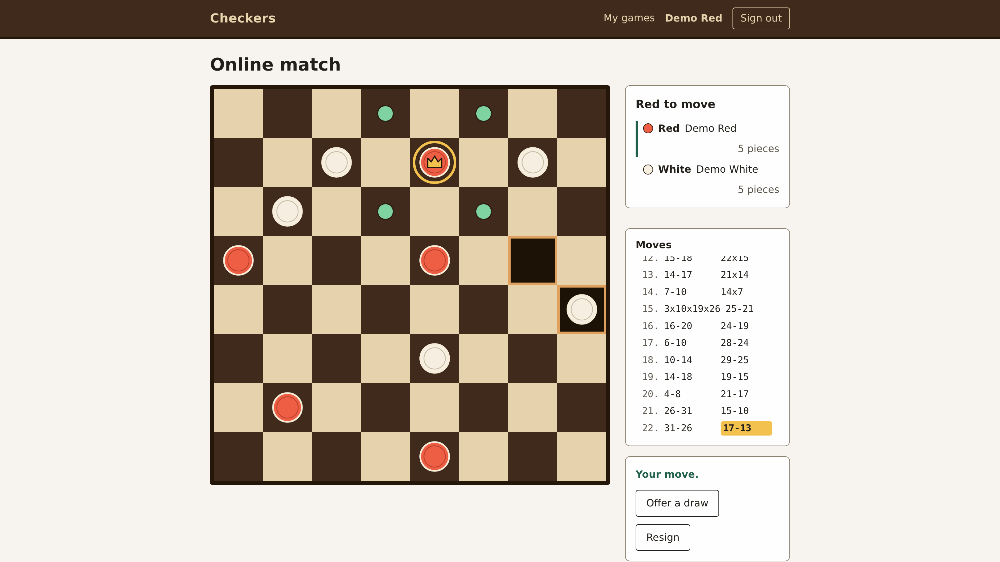
</p>

<p align="center">
  <strong>English draughts as a Ruby on Rails application: a pure-Ruby rules engine that cannot
  see Rails, a stock Rails 8 around it, and Hotwire turning a hot-seat board game into an online
  one.</strong>
</p>

Checkers is a complete implementation of English (American) draughts, not a demonstration slice. Two
people can share one browser, one player can face a pure-Ruby computer opponent at three levels, and
two signed-in players in two browsers can play online with a single-use invite link, live boards,
draw offers, resignation and a colour-swapped rematch. Every match is saved, listed on My games,
replayable ply by ply and exportable as PDN.

The engineering constraint is the interesting part. The rules live in `Draughts`, plain Ruby under
[`lib/draughts/`](lib/draughts), which requires nothing but the standard library: no Rails, no gems.
The browser never decides a rule: legal destinations are computed by the engine on the server, every
move is validated on the server leg by leg, and the whole game plays with JavaScript switched off,
because selection is a URL parameter and every square is a form. What JavaScript adds is the pushing,
so that with it on the opponent's move arrives on its own.

Nothing in the game is an image file either: the board, the pieces, the crown on a king and the dots
on legal destinations are CSS and inline SVG written in code, and a test fails the build if that ever
changes. It all runs in Docker, so Docker with Compose is the only thing you need.

## Highlights

**The game**

- Mandatory capture, multi-jump locked to the jumper, promotion ending the move, one-square kings
- Both automatic draws: threefold repetition, and 80 quiet plies reset by a capture or a man move
- Hot-seat, the computer at three levels, and online play with draw offers and a swapped rematch
- The computer's reply inside the same request as your move, its depth and time printed on the page
- Guest play with no account, and a guest's games adopted by the account that signs in there
- My games, a replay at a URL per ply, and a PDN export with the seven standard headers

**The build**

- 230 engine tests and 11,603 assertions run with Rails never loaded, inside a 2.0 s budget
- Perft asserted exactly on every run: 7, 49, 302, 1469, 7361 nodes at depths 1 to 5
- Hard answered 615 requests over three games at depths 8 to 14, the longest 2.14 s of a 3.0 s pin
- One seat rule per request: 403 without a seat, 422 for an illegal move, the stored row untouched
- A seat's live stream reaches only a connection whose signed-in user holds that seat
- An opponent's move reached the other browser in 0.031 s to 0.195 s, against a 2.0 s budget, and
  every square is a labelled keyboard button, playable at 360 pixels and with JavaScript off
- `bin/ci`: style, three security steps, both engine suites, 619 Rails tests, 59 system tests

## Visual showcase

<table>
  <tr>
    <td width="33%"><a href="docs/images/checkers-computer.png">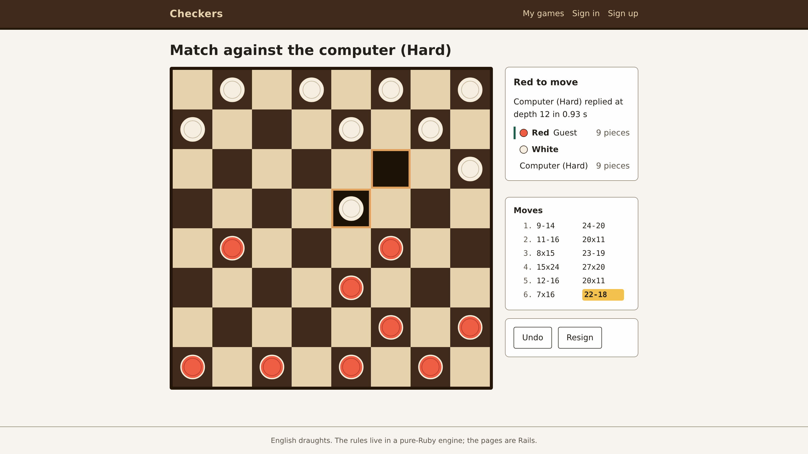</a></td>
    <td width="33%"><a href="docs/images/checkers-replay.png">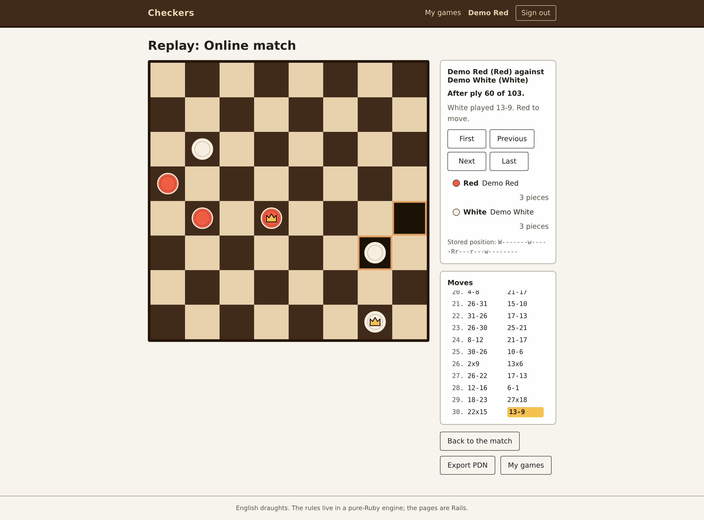</a></td>
    <td width="33%"><a href="docs/images/checkers-my-games.png">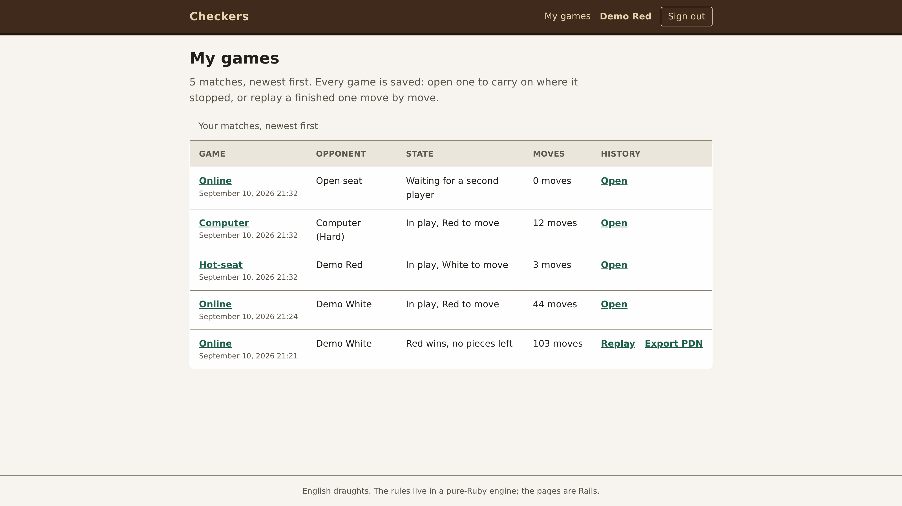</a></td>
  </tr>
  <tr>
    <td align="center">Hard replied at depth 12 in 0.93 s</td>
    <td align="center">Any ply of a finished game, at its own URL</td>
    <td align="center">Every game of this identity, newest first</td>
  </tr>
</table>

<table>
  <tr>
    <td width="33%"><a href="docs/images/checkers-online-invite.png">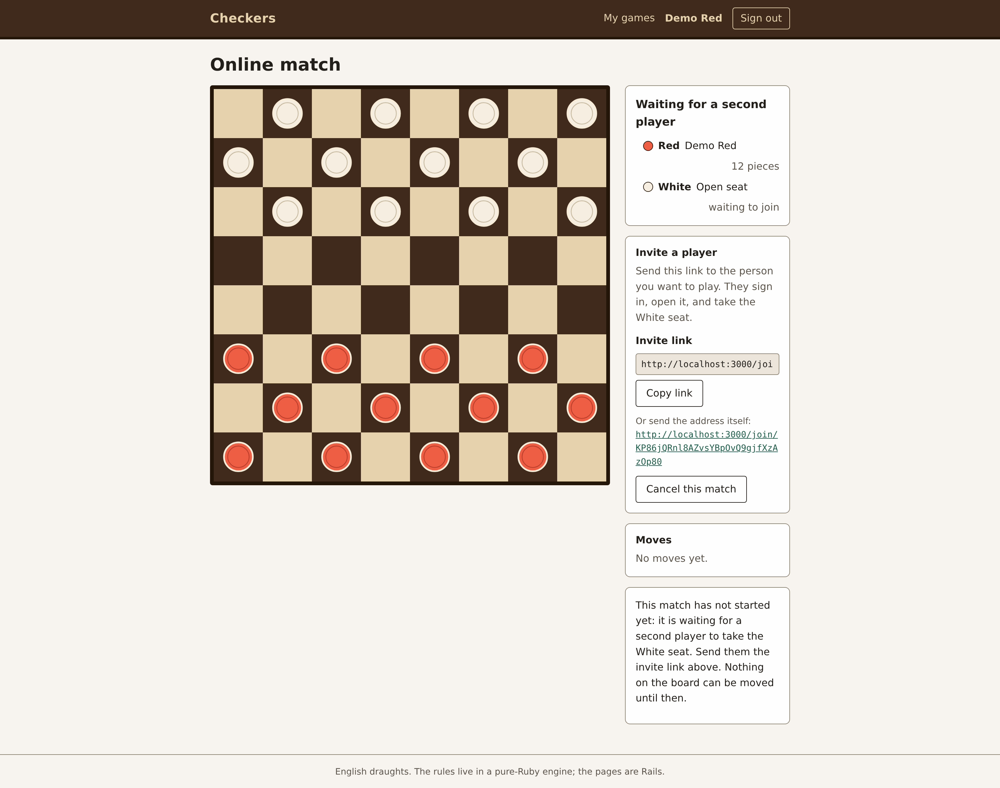</a></td>
    <td width="33%"><a href="docs/images/checkers-phone.png">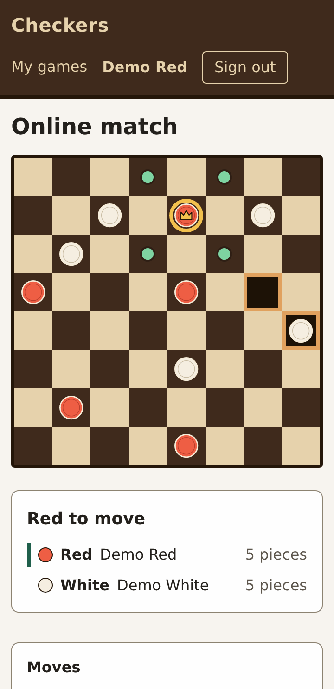</a></td>
    <td width="33%"><a href="docs/images/checkers-keyboard.png">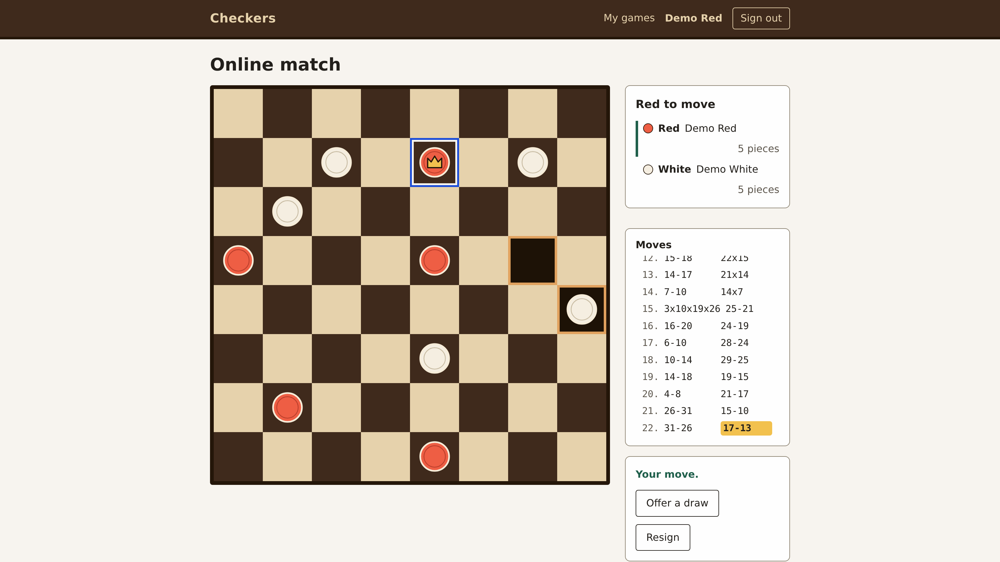</a></td>
  </tr>
  <tr>
    <td align="center">One invite link, single use</td>
    <td align="center">One column at 360 pixels, nothing sideways</td>
    <td align="center">Tab to a square, Enter to select</td>
  </tr>
</table>

## The game

| Rule | As implemented |
| --- | --- |
| Board | 8 by 8, the 32 dark squares playable, PDN numbering 1 to 32; Red men open on 1 to 12, White men on 21 to 32, Red to move. Every position is stored as 32 characters over `r`, `R`, `w`, `W` and `-` |
| Men and kings | A man moves and captures one square diagonally forward; a king moves and captures one square in all four directions. No flying kings |
| Capture | Compulsory: while any capture exists, no quiet move is offered |
| Multi-jump | Locked to the jumping piece until the sequence ends, and written as one move (`24x15x8`) |
| Promotion | A man reaching the far row is crowned, and promotion during a jump ends the move |
| Result | A win when the side to move has no pieces, no legal move, or the opponent resigned; a draw by agreement, by threefold repetition (the starting position counted as the first occurrence), or by the forty-move rule (80 plies with no capture and no man move) |
| Authorisation | 403 for an identity holding no seat, 422 for an illegal move or any action on a match that is not active, the stored position untouched either way |

| Level | What it searches | Measured |
| --- | --- | --- |
| Easy | One uniformly random legal move, no search | Instant |
| Medium | Negamax with alpha-beta to a fixed depth of 4 plies | Milliseconds, and 10 wins in 10 against Easy |
| Hard | Iterative deepening with a transposition table: every depth up to 8 and on to 14 while the budget lasts, stopping at a 2.5 s deadline | Depths 8 to 14, the longest of 615 requests 2.14 s, inside a 3.0 s pin |

| Mode | Account | Seats | Undo | Live |
| --- | --- | --- | --- | --- |
| Hot-seat | No | One browser holds both | The last move | Not needed |
| Computer | No | You hold one, `Computer (Hard)` plays the other | Your move and the reply, two plies | Not needed |
| Online | Both players | One account each, joined by invite link | Not offered, and the endpoint refuses it | Turbo Streams over Action Cable |

All three levels choose at random among equally scored moves, so no two games are alike. Anyone
holding no seat in a match watches it read-only, live, with a note saying so and no control at all.

## Architecture

Three layers over SQLite, and one boundary that is enforced rather than encouraged.

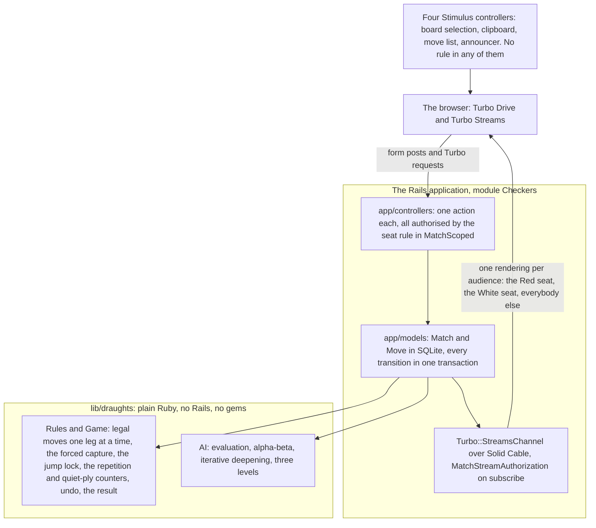

**`lib/draughts` requires nothing from `app/`, from Rails or from any gem.** It owns its require graph
and its whole suite runs where `Rails` is not even defined, which is what makes an exhaustive suite
practical. The browser holds no rule either, and nothing at all is authorised by socket membership.

### A match's life

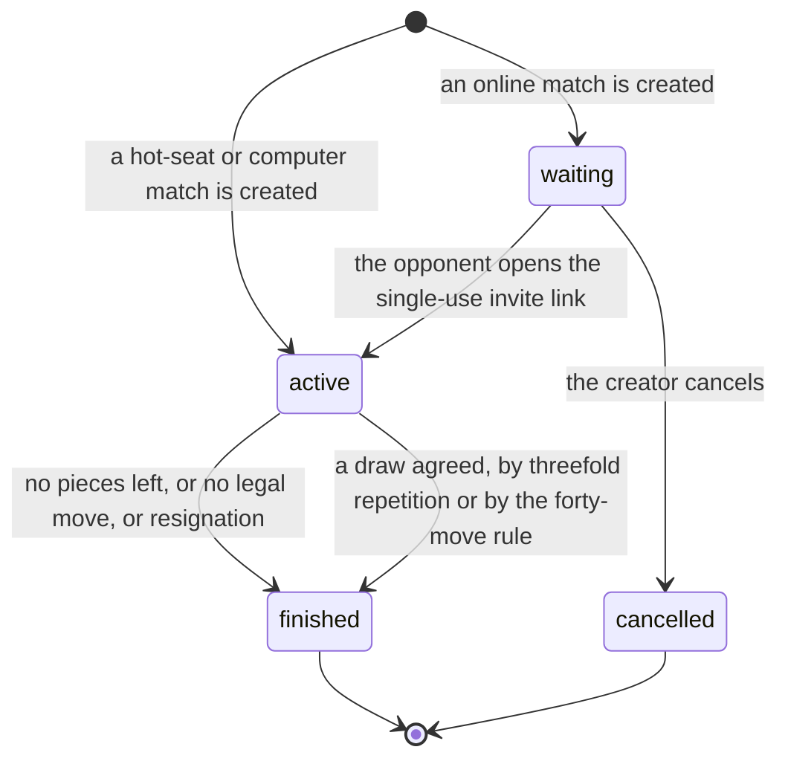

A waiting match is dead: every square is switched off and every transition refuses. A cancelled match
keeps its row, so its page can say what happened and its token stays spent for good. A finished match
keeps its board, its moves and its result, and **Play again never reopens it**: it creates a new one.

### The path of a move

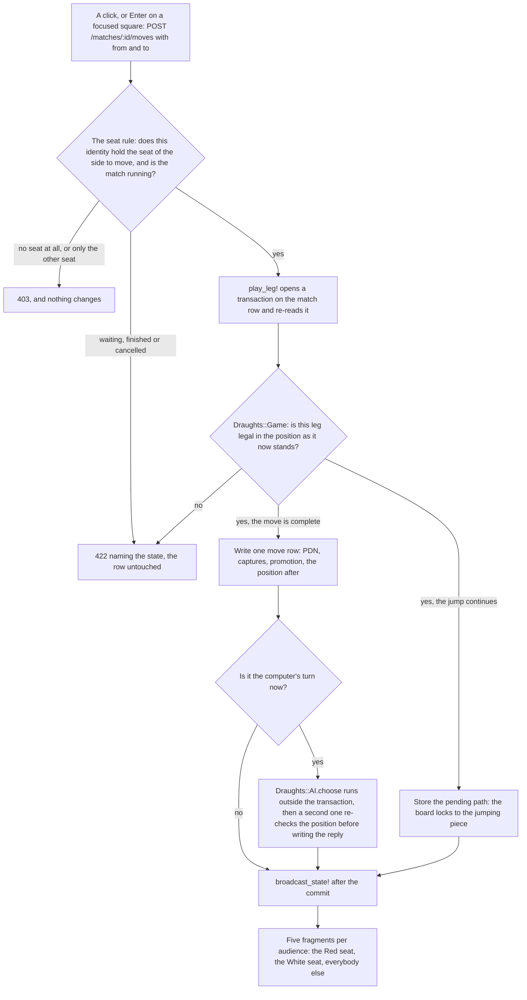

The five fragments are the board, the status, the move list, the controls and the invite panel. The
acting browser gets them in its own response and every other browser watching gets the same five in
one message, so no page shows a board from one action beside a move list from another. With
JavaScript off there is no broadcast at all: the post redirects, and the next page is right.

## Technology

- Ruby 4.0.6, Rails 8.1.3.1 and Bundler 4.0.19, pinned in `.ruby-version` and `Gemfile.lock`
- SQLite everywhere (sqlite3 2.9.6), with Solid Cache 1.0.10, Solid Queue 1.7.0, Solid Cable 4.0.2
- Hotwire: turbo-rails 2.0.23 and stimulus-rails 1.3.4 over Propshaft 1.3.2, importmap-rails 2.2.3
- Puma 8.0.2 behind Thruster 0.1.26 in the production image
- Minitest, Capybara 3.40.0 and selenium-webdriver 4.48.0 driving headless Chromium 152.0.7977.82
- rubocop-rails-omakase 1.1.0, brakeman 8.0.6 and bundler-audit 0.9.3, all three in `bin/ci`
- Only the six Rails frameworks the game uses, required one by one rather than `rails/all`
- Deliberately absent: a JavaScript framework, a build step, a background job, any image file

## Repository map

| Path | Responsibility |
| --- | --- |
| [`lib/draughts/`](lib/draughts) | The rules engine and the computer opponent: PDN numbering, positions, legal moves with forced captures and the jump lock, the draw counters, undo, PDN export, perft, evaluation and search. Plain Ruby |
| [`app/`](app) | The Rails application: `Match` and `Move`, one controller per action, the board and its partials, four Stimulus controllers, three stylesheets, the cable authorisation |
| [`config/`](config) | Rails configuration, the routes, the importmap, and [`config/ci.rb`](config/ci.rb), the ten steps [`bin/ci`](bin/ci) runs |
| [`db/`](db) | Schema, migrations and [`db/seeds.rb`](db/seeds.rb): two demo accounts and one finished 103-ply game, replayed through the engine rather than fixtured |
| [`test/`](test) | The engine's tests and its two Rails-free runners, plus the application's model, controller, integration, channel and system tests |
| [`docs/images/`](docs/images) | Screenshots used by this README; the production image excludes them and the application never reads them |
| [`Dockerfile`](Dockerfile), `Dockerfile.dev`, `compose.yaml` | The production image as Rails generated it, and the development environment every command below uses |
| [`.github/`](.github/workflows/ci.yml) | The same checks on a pull request, split across five jobs |

## Getting started

**Prerequisites.** Docker with Compose, and nothing else.

```sh
docker compose up
```

That is the whole thing. On a machine that has never built this project it builds the development
image from `Dockerfile.dev` (Ruby, SQLite, headless Chromium and its driver: minutes rather than
seconds), installs the gems into a named volume, then creates, migrates and seeds the three
development SQLite databases and starts Puma. With the image and the gems there already it does the
last two, prints `Listening on http://0.0.0.0:3000` in seconds, and <http://localhost:3000> answers.

<p align="center">
  <a href="docs/images/checkers-home.png">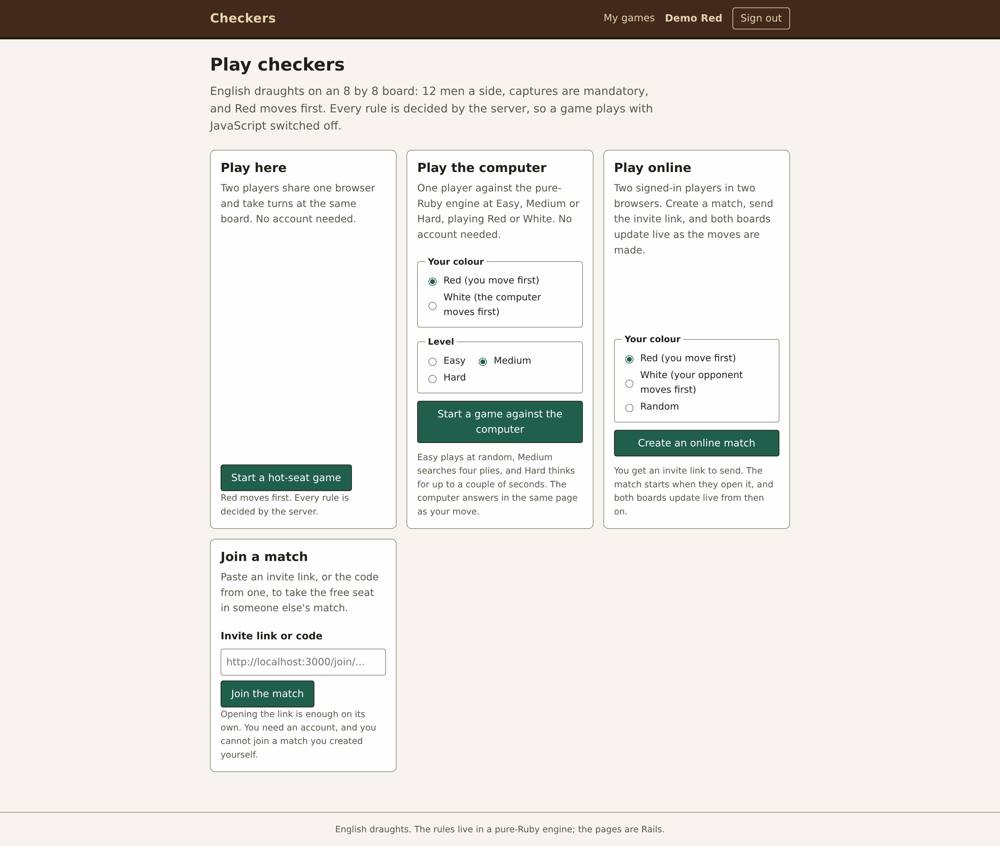</a>
</p>

Four ways in, two of them without an account: **hot-seat**, where two people take turns at the one
browser; **against the computer**, where you pick a colour and a level and the reply comes back in
the same page as your move; **online**, where you sign in, create a match and send the invite link
the waiting page shows to the other player, who opens it in another browser and takes the free seat;
and **join a match**, which takes such a link or the code at the end of it. The seeded database has
two accounts for online play, `demo-red@example.com` and `demo-white@example.com`, both with the
password `demo-checkers`.

**The checks**, all in the same container:

```sh
docker compose run --rm web bin/ci                                              # the whole gate
docker compose run --rm web ruby -Ilib -Itest test/draughts_runner.rb           # the engine, no Rails
docker compose run --rm web ruby --yjit -Ilib -Itest test/draughts_ai_check.rb  # the computer opponent
```

`bin/ci` is style, three security steps, both engine suites, the Rails tests and the system tests in
headless Chromium, about a minute and a half. The runner is the claim that matters for the engine:
it prints that `Rails` is not defined, the perft counts and its wall time from process start, and it
exits 0 only if all four hold, the last under 2.0 seconds. The AI check plays Medium against Easy ten
times, times Hard from four positions, and proves the transposition table changes no chosen move.

**`config/master.key` on a fresh clone.** `config/credentials.yml.enc` is committed and the key that
decrypts it is not (`.gitignore` has `/config/*.key`), the normal state of a cloned Rails application:
no `config/master.key` is tracked, and a local one is ignored. Nothing above needs it, because
development and test generate their own secret in `tmp/local_secret.txt` on first boot. Only production
needs a secret, and it can be handed one directly instead of a key. The credentials hold one value,
`secret_key_base`, so regenerating the pair costs nothing. The production deployment needs either
`SECRET_KEY_BASE` directly or an explicitly supplied `RAILS_MASTER_KEY`.

**The production image** is `Dockerfile`, the one Rails generated: gems without the development group,
assets precompiled, a non-root user, Thruster in front of Puma on port 80. Build it, give it a secret
and a volume for its SQLite databases, and ask it for the health check:

```sh
docker build -t checkers .
# Generate a secret once inside the image, keep it, and give the same value to every run:
docker run --rm checkers ruby -rsecurerandom -e "print SecureRandom.hex(32)" > checkers.secret
docker run -d --name checkers -p 8080:80 -v checkers-storage:/rails/storage -e SECRET_KEY_BASE=$(cat checkers.secret) checkers
# The health check, run inside the container so the host needs no curl:
docker exec checkers curl -s -o /dev/null -w "%{http_code}" http://localhost/up   # prints 200
```

Then open <http://localhost:8080>: the same game in the production environment, its databases in the
named volume. If you hold `config/master.key`, pass `-e RAILS_MASTER_KEY=$(cat config/master.key)`
instead of the generated secret; either way the secret is given at run time and none is baked in. To
remove it: `docker rm -f checkers && docker volume rm checkers-storage && docker rmi checkers`.

The commands above cover the supported development and production paths. The test suite exercises
the game, online play, history, replay, export, demo data, keyboard operation and JavaScript-off
behaviour.

## Verification

`bin/ci` is the whole gate and must exit 0. Its ten steps, on a run that finished in 1m22.80s:

| Step | What it proves | This run |
| --- | --- | --- |
| Setup | The environment is the one the image describes | 2.06 s |
| Style: Ruby | rubocop-rails-omakase over every Ruby file | 2.09 s, 139 files, no offences |
| Security: Gem audit | No gem in the lock has a known advisory | 1.14 s, 1242 advisories |
| Security: Importmap audit | No pinned JavaScript package has a known advisory (every pin here is a local asset, so it checks none today) | 1.11 s |
| Security: Brakeman | Static analysis of the Rails code, failing on any warning | 6.21 s, 0 warnings |
| Tests: Engine, Rails-free | The engine green with `Rails` undefined, perft exact, inside 2.0 s | 1.01 s, 230 tests |
| Tests: AI check | Medium beats Easy, and every Hard move reaches its depth inside 3.0 s | 14.13 s |
| Tests: Rails | Models, controllers, integration, channels, the engine under Rails | 23.36 s, 619 tests |
| Tests: System | A real browser: hot-seat, computer, two-session online play, replay, adoption | 28.86 s, 59 tests |
| Tests: Seeds | `db/seeds.rb` still loads on a clean database and is still idempotent | 2.76 s |

Every number below was measured inside the container against a stated threshold, not estimated.

| Measurement | Result | Threshold |
| --- | --- | --- |
| Perft from the opening, depths 1 to 5 | 7, 49, 302, 1469, 7361 | Exact, asserted on every run |
| Engine suite, Rails-free, wall time from process start | 1.01 s, 230 tests, 11,603 assertions | 2.0 s, enforced by the runner |
| A Hard reply from the opening, a mid-game position and a ten-king endgame | depth 11 in 0.77 s to 1.52 s, depth 8 in 1.06 s to 1.13 s | 3.0 s |
| Hard on that ten-king board and on it plus one more king, over HTTP | 1.26 s to 1.71 s, and 2.01 s to 2.45 s over 26 requests, always at depth 8 | 3.0 s, the 2.5 s deadline unused |
| An opponent's move appearing on the other board | 0.031 s to 0.195 s over the system tests' 12 measured waits | 2.0 s |
| `docker compose up` to the first answered request, image and gems present | 6.0 s | seconds, not minutes |
| Production image | 768 MB, `/up` 200 | must serve |

## Repository scope

This repository is the application: the engine, the Rails code, the tests, the CI configuration, the
development environment and the production Dockerfile. A fresh clone with nothing but Docker runs the
real thing with `docker compose up`. Generated output is excluded on purpose: the SQLite databases,
the logs, `tmp/`, precompiled assets and `config/master.key` are held locally rather than committed.
The specification, the acceptance criteria and the design documents are maintained alongside the
project and are not part of this snapshot.

Three limits are worth stating. Hard's depth-8 floor gives way to a 2.5 second deadline, so a
king-heavy board that cannot search eight plies in that time is answered from the deepest search that
did finish, inside the three-second budget (none measured in play has needed it). A page whose socket
is down misses the broadcasts sent meanwhile and is right on its next reload. My games is not paginated.

## Licensing

No open-source license is included. Unless a separate written agreement grants permission, the
source is provided for viewing and reference only.
